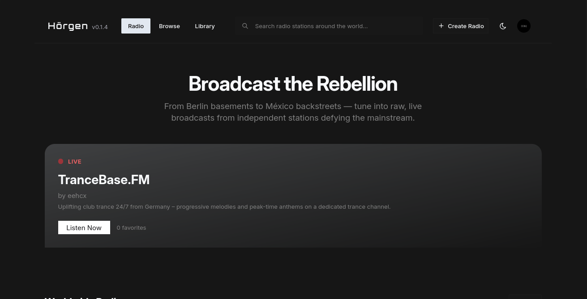
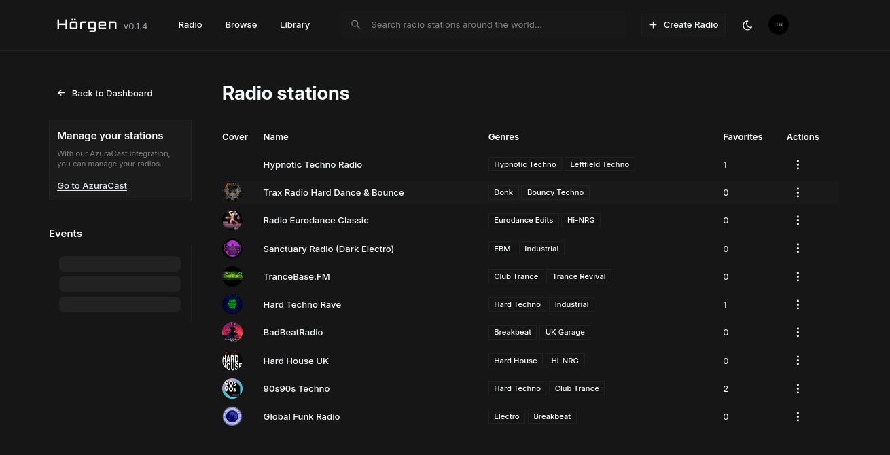

# 🎵 Hoergen WebApp

**Hoergen WebApp** es una aplicación web y de escritorio moderna para radios de música electrónica underground, diseñada para proporcionar una experiencia de streaming de audio excepcional con funcionalidades sociales integradas.



[](https://github.com/eehcx/hoergen.webapp/releases)
[](LICENSE)
[](https://www.typescriptlang.org/)
[](https://react.dev/)
[](https://vitejs.dev/)

## 🎯 Visión del Proyecto

Hoergen WebApp nace de la pasión por la música electrónica underground y la necesidad de crear una plataforma moderna que conecte a creadores, DJs y oyentes en un ecosistema digital innovador. Nuestra misión es democratizar el acceso a la música underground y proporcionar herramientas profesionales para la creación y distribución de contenido musical.

## ✨ Características Principales

### 🎧 Reproductor de Radio Avanzado
- **Streaming de alta calidad** con soporte para múltiples formatos (MP3, AAC, Opus, FLAC)
- **Controles avanzados** de reproducción con ecualizador y efectos
- **Crossfading automático** y transiciones suaves entre estaciones
- **Modo offline** para contenido favorito

### 🏢 Panel de Creadores
- **Gestión completa de estaciones** con herramientas profesionales
- **Creación y programación de eventos** en vivo
- **Moderación de chat** con herramientas automáticas y manuales
- **Analytics detallados** de audiencia y engagement
- **Herramientas de producción** integradas

### 🎧 Panel de Oyentes
- **Descubrimiento inteligente** de nueva música y estaciones
- **Biblioteca personal** con favoritos y colecciones
- **Historial de escucha** con insights personalizados
- **Funcionalidades sociales** y comunidad integrada
- **Personalización completa** de la experiencia

### 🔐 Sistema de Autenticación Robusto
- **Autenticación segura** con JWT y refresh tokens
- **Sistema de roles** (Oyente, Creador, Moderador, Admin)
- **Autorización granular** por funcionalidades
- **Autenticación de dos factores** (2FA)
- **Gestión de sesiones** multi-dispositivo

### 💬 Chat en Vivo Integrado
- **Chat en tiempo real** para cada estación
- **Moderación automática** con filtros inteligentes
- **Comandos de moderación** para creadores
- **Sistema de emojis** y reacciones
- **Historial de mensajes** y logs de moderación

### 🎨 Interfaz Moderna y Responsiva
- **Diseño responsive** para todos los dispositivos
- **Temas personalizables** (claro, oscuro, automático)
- **Accesibilidad completa** con navegación por teclado
- **Componentes UI** basados en Radix UI y Shadcn/ui
- **Animaciones fluidas** y transiciones suaves

## 🛠️ Stack Tecnológico

### Frontend
- **React 19** - Biblioteca de interfaz de usuario
- **TypeScript 5.0** - Tipado estático y desarrollo robusto
- **Vite 5.0** - Bundler moderno y rápido
- **TanStack Router** - Enrutamiento declarativo y type-safe

### UI y Styling
- **TailwindCSS** - Framework CSS utility-first
- **Radix UI** - Componentes primitivos accesibles
- **Shadcn/ui** - Biblioteca de componentes reutilizables
- **Framer Motion** - Animaciones y transiciones

### State Management
- **Zustand** - Gestión de estado ligera y eficiente
- **TanStack Query** - Gestión de estado del servidor
- **React Context** - Estado global de la aplicación

### Testing
- **Vitest** - Framework de testing unitario
- **Testing Library** - Testing de componentes React
- **Playwright** - Testing end-to-end
- **MSW** - Mocking de APIs para testing

### Build y Deployment
- **Vite** - Build tool y dev server
- **TypeScript** - Compilación y verificación de tipos
- **ESLint + Prettier** - Linting y formateo de código
- **GitHub Actions** - CI/CD pipeline

### Desktop (Electron)
- **Electron** - Aplicación de escritorio multiplataforma
- **Electron Builder** - Empaquetado y distribución
- **Auto-updater** - Actualizaciones automáticas

## 🚀 Inicio Rápido

### Prerrequisitos

- **Node.js** 18.0.0 o superior
- **npm** 9.0.0 o superior
- **Git** 2.30.0 o superior

### Instalación

```bash
# Clonar el repositorio
git clone https://github.com/eehcx/hoergen.webapp.git

# Navegar al directorio
cd hoergen.webapp

# Instalar dependencias
npm install

# Configurar variables de entorno
cp .env.example .env.local

# Iniciar servidor de desarrollo
npm run dev
```

### Scripts Disponibles

```bash
# Desarrollo
npm run dev              # Servidor de desarrollo
npm run dev:debug        # Modo debug
npm run dev:analyze      # Con análisis de bundle

# Build
npm run build            # Build de producción
npm run build:staging    # Build de staging
npm run build:analyze    # Con análisis de bundle

# Testing
npm run test             # Tests unitarios
npm run test:coverage    # Con cobertura
npm run test:e2e         # Tests end-to-end

# Linting y Formateo
npm run lint             # Ejecutar ESLint
npm run lint:fix         # Auto-fix de ESLint
npm run format:check     # Verificar Prettier
npm run format:write     # Formatear código

# Utilidades
npm run type-check       # Verificar tipos TypeScript
npm run clean            # Limpiar directorios de build
npm run preview          # Preview del build
```

## 📚 Documentación

### 📖 Guías Principales

- **[🚀 Guía de Inicio Rápido](docs/getting-started.md)** - Instalación y configuración
- **[🏗️ Arquitectura](docs/architecture.md)** - Estructura del proyecto y patrones
- **[🛣️ Sistema de Rutas](docs/routing.md)** - Navegación y routing
- **[🎨 Componentes UI](docs/components.md)** - Biblioteca de componentes

### 👥 Guías de Usuario

- **[🎵 Panel de Creadores](docs/creator-panel.md)** - Gestión de estaciones y eventos
- **[🎧 Panel de Oyentes](docs/listener-panel.md)** - Exploración y biblioteca personal
- **[👥 Panel de Administración](docs/admin-panel.md)** - Gestión del sistema
- **[⚙️ Configuración](docs/settings.md)** - Personalización y preferencias

### 🔧 Guías de Desarrollo

- **[🔧 Desarrollo y Build](docs/development.md)** - Configuración del entorno
- **[📊 API y Servicios](docs/api-services.md)** - Integración con backend
- **[🧪 Testing](docs/testing.md)** - Estrategias y herramientas de testing
- **[🚀 Deployment](docs/deployment.md)** - Despliegue y producción

### 📻 Funcionalidades Específicas

- **[📻 Funcionalidades de Radio](docs/radio-features.md)** - Reproductor y streaming
- **[🔐 Autenticación](docs/authentication.md)** - Sistema de auth y seguridad
- **[🖥️ Electron](docs/electron.md)** - Aplicación de escritorio

### 📝 Otros Recursos

- **[📝 Changelog](docs/changelog.md)** - Historial de versiones
- **[📚 Documentación Completa](docs/README.md)** - Índice general

## 🌟 Características Destacadas

### 🎵 Experiencia de Audio Excepcional
- **Calidad de streaming** configurable (64kbps - 320kbps)
- **Buffer inteligente** para conexiones inestables
- **Ecualizador de 10 bandas** con presets personalizables
- **Efectos de audio** (reverb, delay, compresión)
- **Normalización automática** de volumen

### 🚀 Performance Optimizada
- **Code splitting** inteligente para bundles optimizados
- **Lazy loading** de componentes y rutas
- **Service Worker** para caching offline
- **Optimización de imágenes** automática
- **Tree shaking** para eliminar código no utilizado

### 🔒 Seguridad y Privacidad
- **HTTPS obligatorio** en producción
- **CORS configurado** para APIs
- **Rate limiting** para prevenir abusos
- **Validación de entrada** robusta
- **Sanitización de datos** para prevenir XSS

### ♿ Accesibilidad Completa
- **Navegación por teclado** completa
- **Lectores de pantalla** compatibles
- **Contraste alto** configurable
- **Etiquetas ARIA** apropiadas
- **Navegación semántica** con encabezados

## 🎨 Capturas de Pantalla

### Panel Principal


### Reproductor de Audio


### Panel de Creadores


## 🤝 Contribuir

### Cómo Contribuir

1. **Fork** el repositorio
2. **Crea** una rama para tu feature (`git checkout -b feature/AmazingFeature`)
3. **Commit** tus cambios (`git commit -m 'Add some AmazingFeature'`)
4. **Push** a la rama (`git push origin feature/AmazingFeature`)
5. **Abre** un Pull Request

### Guías de Contribución

- **Código de Conducta**: [CODE_OF_CONDUCT.md](CODE_OF_CONDUCT.md)
- **Guía de Contribución**: [CONTRIBUTING.md](CONTRIBUTING.md)
- **Estándares de Código**: [docs/development.md](docs/development.md)

### Áreas de Contribución

- 🐛 **Reportar bugs** en [Issues](https://github.com/eehcx/hoergen.webapp/issues)
- 💡 **Sugerir features** en [Discussions](https://github.com/eehcx/hoergen.webapp/discussions)
- 📚 **Mejorar documentación** en [Wiki](https://github.com/eehcx/hoergen.webapp/wiki)
- 🔧 **Contribuir código** siguiendo las guías de desarrollo

## 📊 Estado del Proyecto

### Versión Actual
- **Versión**: 0.1.4 (Beta)
- **Estado**: Desarrollo activo
- **Última actualización**: Diciembre 2024

### Roadmap

#### v0.2.0 (Q1 2025)
- Sistema de notificaciones push
- Modo offline completo
- Integración con Discord

#### v0.3.0 (Q2 2025)
- Sistema de monetización
- Integración con redes sociales
- Analytics avanzados

#### v1.0.0 (Q4 2025)
- Versión estable de producción
- Aplicación móvil nativa
- API pública documentada

## 🐛 Reportar Problemas

### Antes de Reportar

1. **Verifica** que el problema no esté ya reportado
2. **Busca** en [Issues](https://github.com/eehcx/hoergen.webapp/issues)
3. **Revisa** la [documentación](docs/README.md)
4. **Prueba** en la última versión

### Información Necesaria

- **Versión** de la aplicación
- **Sistema operativo** y versión
- **Navegador** (si aplica)
- **Pasos** para reproducir el problema
- **Comportamiento esperado** vs actual
- **Logs** de error (si están disponibles)

## 📞 Soporte y Comunidad

### Canales de Soporte

- **📧 Email**: eehcx.contacto@gmail.com
- **🐛 Issues**: [GitHub Issues](https://github.com/eehcx/hoergen.webapp/issues)
- **💬 Discord**: [Servidor de Discord](https://discord.gg/hoergen)
- **📱 Telegram**: [Canal de Telegram](https://t.me/hoergen)

### Recursos de Ayuda

- **📚 Documentación**: [docs/README.md](docs/README.md)
- **❓ FAQ**: [Preguntas Frecuentes](docs/faq.md)
- **🎥 Tutoriales**: [Videos de YouTube](https://youtube.com/@hoergen)
- **📖 Wiki**: [GitHub Wiki](https://github.com/eehcx/hoergen.webapp/wiki)

## 📄 Licencia

Este proyecto está bajo la licencia **MIT**. Ver el archivo [LICENSE](LICENSE) para más detalles.

```
MIT License

Copyright (c) 2024 Enoc Hernandez (@eehcx)

Permission is hereby granted, free of charge, to any person obtaining a copy
of this software and associated documentation files (the "Software"), to deal
in the Software without restriction, including without limitation the rights
to use, copy, modify, merge, publish, distribute, sublicense, and/or sell
copies of the Software, and to permit persons to whom the Software is
furnished to do so, subject to the following conditions:

The above copyright notice and this permission notice shall be included in all
copies or substantial portions of the Software.

THE SOFTWARE IS PROVIDED "AS IS", WITHOUT WARRANTY OF ANY KIND, EXPRESS OR
IMPLIED, INCLUDING BUT NOT LIMITED TO THE WARRANTIES OF MERCHANTABILITY,
FITNESS FOR A PARTICULAR PURPOSE AND NONINFRINGEMENT. IN NO EVENT SHALL THE
AUTHORS OR COPYRIGHT HOLDERS BE LIABLE FOR ANY CLAIM, DAMAGES OR OTHER
LIABILITY, WHETHER IN AN ACTION OF CONTRACT, TORT OR OTHERWISE, ARISING FROM,
OUT OF OR IN CONNECTION WITH THE SOFTWARE OR THE USE OR OTHER DEALINGS IN THE
SOFTWARE.
```

## 🙏 Agradecimientos

### Contribuidores

- **Enoc Hernandez** (@eehcx) - Fundador y desarrollador principal
- **Comunidad de desarrolladores** - Contribuciones y feedback
- **Usuarios beta** - Testing y reportes de bugs

### Tecnologías y Herramientas

- **React Team** - Framework de interfaz de usuario
- **Vite Team** - Build tool moderno
- **TailwindCSS** - Framework CSS utility-first
- **Radix UI** - Componentes primitivos accesibles
- **Shadcn/ui** - Biblioteca de componentes

### Inspiración

- **Plataformas de streaming** existentes
- **Comunidad de música electrónica** underground
- **Desarrolladores open source** que comparten conocimiento

---

## ⭐ ¿Te Gusta el Proyecto?

Si Hoergen WebApp te resulta útil, considera:

- **⭐ Dar una estrella** en GitHub
- **🔄 Hacer fork** del repositorio
- **💬 Unirte** a nuestra comunidad
- **🐛 Reportar bugs** que encuentres
- **💡 Sugerir** nuevas funcionalidades
- **📚 Contribuir** a la documentación

---

**Desarrollado con ❤️ por la comunidad de Hoergen**

*Última actualización: Diciembre 2024*
*Versión: 0.1.4*