# 🔐 Sistema de Autenticación

## 📋 Descripción General

El sistema de autenticación de **Hoergen WebApp** proporciona un mecanismo robusto y seguro para la gestión de usuarios, sesiones y autorización basada en roles. Está diseñado para manejar múltiples tipos de usuarios con diferentes niveles de acceso.

## 🏗️ Arquitectura del Sistema

### Componentes Principales

```
src/
├── context/
│   └── AuthContext.tsx          # Contexto de autenticación
├── stores/
│   └── authStore.ts             # Store de estado de auth
├── core/
│   ├── guard/
│   │   ├── authGuard.tsx        # Guard de autenticación
│   │   └── roleGuard.tsx        # Guard de roles
│   └── services/
│       └── auth.service.ts       # Servicio de autenticación
├── hooks/
│   └── auth/
│       ├── useAuth.ts           # Hook principal de auth
│       └── usePermissions.ts    # Hook de permisos
└── lib/
    └── auth.ts                  # Utilidades de autenticación
```

### Flujo de Autenticación

```mermaid
graph TD
    A[Usuario] --> B[Página de Login]
    B --> C[Credenciales]
    C --> D[Validación Backend]
    D --> E{¿Válidas?}
    E -->|Sí| F[Token JWT]
    E -->|No| G[Error]
    F --> H[Almacenamiento Local]
    H --> I[Redirección Dashboard]
    I --> J[Protección de Rutas]
```



## 🔑 Tipos de Usuario

### Roles del Sistema

#### 1. **Listener** (Oyente)
- **Permisos**: Básicos de usuario
- **Acceso**: Explorar estaciones, chat, favoritos
- **Restricciones**: No puede crear contenido

#### 2. **Creator** (Creador)
- **Permisos**: Listener + gestión de estaciones
- **Acceso**: Crear/editar estaciones, eventos, moderar chat
- **Restricciones**: Solo sus propias estaciones

#### 3. **Admin** (Administrador)
- **Permisos**: Acceso completo al sistema
- **Acceso**: Panel de administración, moderación global
- **Restricciones**: Ninguna

#### 4. **Super Admin** (Super Administrador)
- **Permisos**: Admin + gestión de usuarios admin
- **Acceso**: Configuración del sistema, auditoría
- **Restricciones**: Solo configuración crítica

### Jerarquía de Permisos

```
Super Admin
    ↓
    Admin
    ↓
    Creator
    ↓
    Listener
```

## 🚀 Implementación

### AuthContext

```tsx
import { createContext, useContext, ReactNode } from 'react'

interface AuthContextType {
  user: User | null
  isAuthenticated: boolean
  isLoading: boolean
  login: (credentials: LoginCredentials) => Promise<void>
  logout: () => void
  refreshToken: () => Promise<void>
}

const AuthContext = createContext<AuthContextType | undefined>(undefined)

export const useAuth = () => {
  const context = useContext(AuthContext)
  if (!context) {
    throw new Error('useAuth debe usarse dentro de AuthProvider')
  }
  return context
}
```

### AuthStore (Zustand)

```tsx
import { create } from 'zustand'
import { persist } from 'zustand/middleware'

interface AuthState {
  user: User | null
  token: string | null
  refreshToken: string | null
  isAuthenticated: boolean
  
  // Actions
  setUser: (user: User) => void
  setToken: (token: string) => void
  setRefreshToken: (refreshToken: string) => void
  logout: () => void
  updateUser: (updates: Partial<User>) => void
}

export const useAuthStore = create<AuthState>()(
  persist(
    (set, get) => ({
      user: null,
      token: null,
      refreshToken: null,
      isAuthenticated: false,

      setUser: (user) => set({ user, isAuthenticated: true }),
      setToken: (token) => set({ token }),
      setRefreshToken: (refreshToken) => set({ refreshToken }),
      
      logout: () => set({
        user: null,
        token: null,
        refreshToken: null,
        isAuthenticated: false
      }),
      
      updateUser: (updates) => {
        const currentUser = get().user
        if (currentUser) {
          set({ user: { ...currentUser, ...updates } })
        }
      }
    }),
    {
      name: 'auth-storage',
      partialize: (state) => ({
        token: state.token,
        refreshToken: state.refreshToken,
        user: state.user
      })
    }
  )
)
```

### Hook useAuth

```tsx
import { useAuthStore } from '@/stores/authStore'
import { authService } from '@/core/services/auth.service'

export const useAuth = () => {
  const store = useAuthStore()

  const login = async (credentials: LoginCredentials) => {
    try {
      const response = await authService.login(credentials)
      
      store.setToken(response.accessToken)
      store.setRefreshToken(response.refreshToken)
      store.setUser(response.user)
      
      // Configurar interceptor para requests
      setupAuthInterceptor(response.accessToken)
      
    } catch (error) {
      throw new Error('Error en login: ' + error.message)
    }
  }

  const logout = async () => {
    try {
      await authService.logout()
    } finally {
      store.logout()
      // Limpiar interceptor
      clearAuthInterceptor()
    }
  }

  const refreshToken = async () => {
    try {
      const response = await authService.refreshToken(store.refreshToken!)
      store.setToken(response.accessToken)
      setupAuthInterceptor(response.accessToken)
    } catch (error) {
      store.logout()
      throw error
    }
  }

  return {
    user: store.user,
    isAuthenticated: store.isAuthenticated,
    isLoading: false,
    login,
    logout,
    refreshToken
  }
}
```

## 🛡️ Protección de Rutas

### AuthGuard

```tsx
import { Navigate, useLocation } from 'react-router-dom'
import { useAuth } from '@/hooks/auth/useAuth'

interface AuthGuardProps {
  children: React.ReactNode
  requireAuth?: boolean
}

export const AuthGuard = ({ children, requireAuth = true }: AuthGuardProps) => {
  const { isAuthenticated, isLoading } = useAuth()
  const location = useLocation()

  if (isLoading) {
    return <LoadingSpinner />
  }

  if (requireAuth && !isAuthenticated) {
    // Redirigir a login con la ruta actual como redirect
    return <Navigate to="/sign-in" state={{ from: location }} replace />
  }

  if (!requireAuth && isAuthenticated) {
    // Usuario autenticado intentando acceder a rutas públicas
    return <Navigate to="/dashboard" replace />
  }

  return <>{children}</>
}
```

### RoleGuard

```tsx
import { useAuth } from '@/hooks/auth/useAuth'
import { usePermissions } from '@/hooks/auth/usePermissions'

interface RoleGuardProps {
  children: React.ReactNode
  requiredRoles: UserRole[]
  fallback?: React.ReactNode
}

export const RoleGuard = ({ 
  children, 
  requiredRoles, 
  fallback = <ForbiddenPage /> 
}: RoleGuardProps) => {
  const { user } = useAuth()
  const { hasRole, hasPermission } = usePermissions()

  if (!user) {
    return <Navigate to="/sign-in" replace />
  }

  const hasRequiredRole = requiredRoles.some(role => hasRole(role))

  if (!hasRequiredRole) {
    return fallback
  }

  return <>{children}</>
}
```

### Uso en Rutas

```tsx
import { AuthGuard, RoleGuard } from '@/core/guard'

// Ruta protegida que requiere autenticación
<Route
  path="/dashboard"
  element={
    <AuthGuard>
      <DashboardPage />
    </AuthGuard>
  }
/>

// Ruta que requiere rol específico
<Route
  path="/admin"
  element={
    <AuthGuard>
      <RoleGuard requiredRoles={['admin', 'super_admin']}>
        <AdminPage />
      </RoleGuard>
    </AuthGuard>
  }
/>
```

## 🔐 Gestión de Tokens

### Estructura del Token JWT

```typescript
interface JWTPayload {
  sub: string           // User ID
  email: string         // User email
  role: UserRole        // User role
  permissions: string[] // User permissions
  iat: number          // Issued at
  exp: number          // Expiration time
  jti: string          // JWT ID
}
```

### Interceptor de Requests

```tsx
import axios from 'axios'
import { useAuthStore } from '@/stores/authStore'

const setupAuthInterceptor = (token: string) => {
  // Request interceptor
  axios.interceptors.request.use(
    (config) => {
      if (token) {
        config.headers.Authorization = `Bearer ${token}`
      }
      return config
    },
    (error) => Promise.reject(error)
  )

  // Response interceptor
  axios.interceptors.response.use(
    (response) => response,
    async (error) => {
      const originalRequest = error.config

      if (error.response?.status === 401 && !originalRequest._retry) {
        originalRequest._retry = true

        try {
          const store = useAuthStore.getState()
          const newToken = await refreshToken(store.refreshToken!)
          
          store.setToken(newToken)
          originalRequest.headers.Authorization = `Bearer ${newToken}`
          
          return axios(originalRequest)
        } catch (refreshError) {
          store.logout()
          return Promise.reject(refreshError)
        }
      }

      return Promise.reject(error)
    }
  )
}
```

## 🔒 Seguridad

### Medidas de Seguridad Implementadas

#### 1. **HTTPS Obligatorio**
- Todas las comunicaciones cliente-servidor usan HTTPS
- Redirección automática de HTTP a HTTPS

#### 2. **Tokens JWT Seguros**
- Expiración configurable (15 minutos por defecto)
- Refresh tokens con expiración extendida (7 días)
- Almacenamiento seguro en localStorage con encriptación

#### 3. **Protección CSRF**
- Tokens CSRF en formularios críticos
- Validación de origen de requests

#### 4. **Rate Limiting**
- Límite de intentos de login (5 por 15 minutos)
- Bloqueo temporal de cuenta tras múltiples fallos

#### 5. **Validación de Entrada**
- Sanitización de datos de entrada
- Validación con Zod schemas
- Prevención de inyección SQL/XSS

### Configuración de Seguridad

```typescript
// Configuración de seguridad
const securityConfig = {
  jwt: {
    accessTokenExpiry: '15m',
    refreshTokenExpiry: '7d',
    algorithm: 'HS256'
  },
  password: {
    minLength: 8,
    requireUppercase: true,
    requireLowercase: true,
    requireNumbers: true,
    requireSpecialChars: true
  },
  session: {
    maxConcurrentSessions: 3,
    idleTimeout: 30 * 60 * 1000, // 30 minutos
    absoluteTimeout: 24 * 60 * 60 * 1000 // 24 horas
  }
}
```

## 📱 Autenticación Móvil

### Persistencia de Sesión

```tsx
// Hook para manejar persistencia en dispositivos móviles
export const usePersistentAuth = () => {
  const [isPersistent, setIsPersistent] = useState(false)

  useEffect(() => {
    // Detectar si el dispositivo soporta persistencia
    if ('storage' in navigator && 'persist' in navigator.storage) {
      navigator.storage.persist().then((persisted) => {
        setIsPersistent(persisted)
      })
    }
  }, [])

  return { isPersistent }
}
```

### Biometría (Futuro)

```tsx
// Hook para autenticación biométrica (planificado)
export const useBiometricAuth = () => {
  const authenticateWithBiometrics = async () => {
    if ('credentials' in navigator && 'preventSilentAccess' in navigator.credentials) {
      try {
        const credential = await navigator.credentials.get({
          publicKey: {
            challenge: new Uint8Array(32),
            rpId: 'hoergen.app',
            userVerification: 'required'
          }
        })
        return credential
      } catch (error) {
        console.error('Error en autenticación biométrica:', error)
        throw error
      }
    }
  }

  return { authenticateWithBiometrics }
}
```

## 🔄 Flujos de Autenticación

### Login Estándar


### Refresh Token


### Logout


## 🧪 Testing

### Tests de Autenticación

```typescript
import { render, screen, fireEvent, waitFor } from '@testing-library/react'
import { AuthProvider } from '@/context/AuthContext'
import { LoginPage } from '@/features/auth/sign-in'

describe('Authentication Flow', () => {
  test('login exitoso redirige a dashboard', async () => {
    render(
      <AuthProvider>
        <LoginPage />
      </AuthProvider>
    )

    fireEvent.change(screen.getByLabelText('Email'), {
      target: { value: 'test@example.com' }
    })
    fireEvent.change(screen.getByLabelText('Contraseña'), {
      target: { value: 'password123' }
    })

    fireEvent.click(screen.getByRole('button', { name: 'Iniciar Sesión' }))

    await waitFor(() => {
      expect(window.location.pathname).toBe('/dashboard')
    })
  })

  test('credenciales inválidas muestran error', async () => {
    // Mock del servicio de auth para simular error
    jest.spyOn(authService, 'login').mockRejectedValue(
      new Error('Credenciales inválidas')
    )

    render(
      <AuthProvider>
        <LoginPage />
      </AuthProvider>
    )

    // ... test implementation
  })
})
```

## 🚀 Mejoras Futuras

### Funcionalidades Planificadas

#### 1. **Autenticación de Dos Factores (2FA)**
- SMS/Email verification
- TOTP (Google Authenticator)
- Backup codes

#### 2. **OAuth Social**
- Google OAuth
- Facebook OAuth
- Apple Sign-In

#### 3. **Single Sign-On (SSO)**
- Integración con sistemas empresariales
- SAML 2.0
- OpenID Connect

#### 4. **Análisis de Seguridad**
- Detección de login sospechoso
- Geolocalización de sesiones
- Alertas de seguridad

## 📚 Recursos Adicionales

- [JWT.io](https://jwt.io/) - Decodificador y documentación JWT
- [OWASP Authentication Cheat Sheet](https://cheatsheetseries.owasp.org/cheatsheets/Authentication_Cheat_Sheet.html)
- [React Security Best Practices](https://reactsecurity.dev/)
- [Zustand Documentation](https://zustand-demo.pmnd.rs/)

---

**Última actualización**: Diciembre 2024  
**Versión**: 0.1.4  
**Mantenedor**: Equipo de Desarrollo
